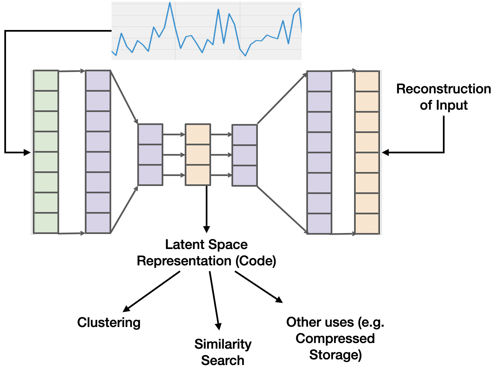

# Analytics Project

In this project, you will be implementing an AutoEncoder to support timeseries compression
while preserving similarity search. You'll first implement one of the autoencoders
presented in a paper of your choice (see paper section below). Then, you'll try your best
to improve the autoencoder results.

## AutoEncoders

Briefly, deep autoencoders are neural networks that introduce a bottleneck in the network.
The section before the bottleneck is called the encoder. The section after the bottleneck
is called the decoder. During training, the autoencoder learns how to reconstruct the
input data. In doing so, the bottleneck generates a small matrix (or vector) that, should
retain important information about the input. This is called the __latent space__.

## Papers

There are a growing number of papers that use autoencoders for timeseries clustering. We
include two of the more recent ones:

* [Learning Representations for Time Series Clustering][1]
* [Salient Subsequence Learning for Time Series Clustering][2]
* [RTFN: Robust Temporal Feature Network][3]

We suggest you find papers that have code that you can replicate. Alot of this code uses
TensorFlow v1. Therefore, part of your task is porting or interpretting the autoencoder
architecture to TensorFlow v2.

## Code

### Repositories

[https://github.com/fsolleza/timeseries-similarity](https://github.com/fsolleza/timeseries-similarity) contains the code for the actual project. See the brief code description below.

[https://github.com/fsolleza/timeseries-data](https://github.com/fsolleza/timeseries-data)
contains code that helps you read in benchmark datasets used in academia for timeseries
analytics tasks. Read the repository's README for how to use this repository.

### Brief code description

The code uses Python and TensorFlow to implement a simple autoencoder. The file
`auto_encoder.py` has two Model classes: `Encoder` and `Decoder`. There is also a
`train_step` function that executes a single training step and backpropagates the loss.
`Experiments.ipynb` shows how to train and run the experiments we care about.

### Specific goals:

*Similarity-preserving representation*: There are a few ways of measuring "similarity". In
our case, we'll be using a distance measure of your choice (e.g. [K-Shape][4]'s SBD
distance). For two timeseries `a` and `b` and an encoder `e`, the goal is to preserve
SBD-based similarity s.t. `l2(e(a) - e(b)) ~ sbd(a, b)`. That is, the Euclidean distance of
the codes of `a` and `b` approximates their SBD.

*Reconstruction*: This is fairly standard fair in autoencoders. The reconstruction loss of
of an autoencoder is `mse(a, d(e(a)))` where `d` is the decoder, `e` is the autoencoder,
and `mse` is the mean squared error.

### Experiments

The `Experiments.ipynb` file contains a few experiments you can start out with to evaluate
your results. In particular, there are two experiments:

1. Reconstruction: How closely does the autoencoder reconstruct the input data compared
   using Euclidean distance.
2. Similarity: How closely does the code preserve similarity. In this case, the similarity
   metric used between two timeseries is Euclidean distance. However, you should change
   this to some better distance metric (e.g. SBD).

[return home](index.md)

[1]: ./papers/dtcr.pdf
[2]: ./papers/ussl.pdf
[3]: ./papers/rtfn.pdf
[4]: ./papers/kshape.pdf

