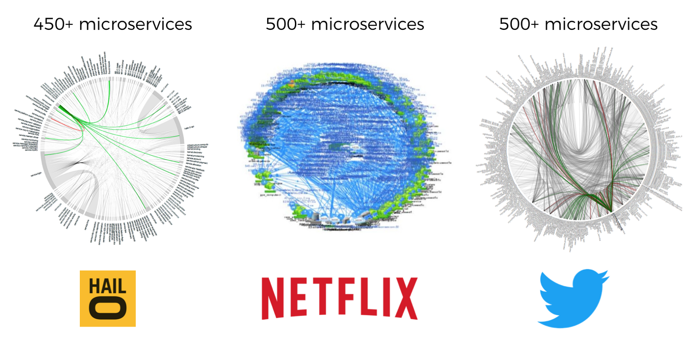
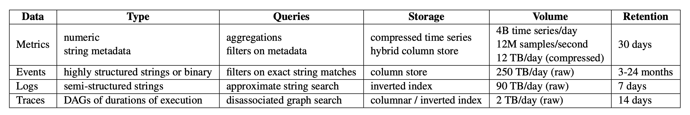

# CS227 2022 The Daily Petabyte: Managing Cloud-Native Systems Through Observability
Professor: Prof. Stan Zdonik  
TA: Franco Solleza  
  
Mondays, 15.00 - 17.30, First class is on Monday, January 31, 2022  
Room: CIT 316
Zoom Link: [https://brown.zoom.us/j/92550023931](https://brown.zoom.us/j/92550023931)  
Piazza: [piazza.com/brown/spring2021/csci2270](piazza.com/brown/spring2022/csci2270)  
Questions? Email Franco (first_last@brown.edu)  

## A note on Zoom / In-Person

We highly highly HIGHLY encourage in-person attendance. We will also have the zoom available and
will be recording the session. Howevr, the recording will **_not_** be available without emailing
Franco. We have the discretion whether to release this recording to a student requesting the
recording.

## A note on override Codes

If you are requesting an override code, please do so on CAB. However, also email me and
Prof. Zdonik. We'll be sending them out all at once.

Please fill out [this form](https://forms.gle/hmEo8XNZzKG15L7J7) just to be sure we get your request covered.

## Table of Contents

* [What this class is about](#what-this-class-is-about)
* [Projects](#projects)
    * [Project Requirements](#project-requirements)
    * [Project Options](#project-options)
    * [Project Assignments](#project-assignments)
* [Readings](#readings)
    * [Reading Summaries](#reading-summaries)
    * [Reading Assignments](#reading-assignments)
* [Schedule](#schedule)
    * [Introduction to Observability and Container Orchestration with Kubernetes](#topic-introduction-to-observability-and-container-orchestration-with-kubernetes)
    * [Industry and Academia](#topic-the-mix-of-industry-and-academia)
    * [Observability Industry Systems](#topic-observability-industry-systems)
    * [Putting It All Together](#topic-putting-it-all-together)
    * [Projects Presentations](#topic-projects-presentations)

## What this class is about

Modern software systems are complex and are frequently broken into many component microservices.
Managing these microservices requires visibility into the system state using massive amounts of
data generated by the system reflecting its state. When some symptom of an issue occurs like
some slow down in response time, engineers would look through these data to get alerted of the
symptom, identify the root cause, and resolve the issue. This process of observing and managing
system state is called Observability.

Observability is fundamentally a data management problem: how to generate, collect, ingest, store,
and query vast amounts of heterogeneous data. As an example, the table below shows that on any given day, Slack maintains more than a petabyte of data and  generates nearly half a petabyte per day.

In this class, we'll take a look at Observability and the current challenges in Observability.
We'll take a look at Observability as a data management workload and the tools to support this
workload that are used in industry and proposed by academia. We'll also discuss what abstractions
might improve the process of Observability.

The class schedule will follow the following high level outline:

1. Academic work that explores the workloads of metrics, logs, and traces: Many of the workload
   characteristics in Observability have been well studied. We'll take a look at some of the more
   recent work in each of the data types.

   **What you will do:** Each class, you will read two papers describing proposals about how to
   handle a a particular type of data in Observability. Each group will present one or more papers
   depending on how many groups are in the class. The rest of the class will submit reading
   summaries.

   [Industry and Academia](#topic-the-mix-of-industry-and-academia)

2. The tools industry uses: We'll dive into the implementation details of some of the industry
   standard tools used in Observability. This means we'll be reading some code and presenting
   in-depth summaries of how these tools do what they they do.

   **What you will do:** Each class, you will read one paper describing a proposal about how to
   handle a particular type of Observability data. Each group will also choose a system and present
   an in-depth explanation of how the system works. The presentation should describe the system's
   goals, how the system ingests, stores, and queries data. This will require significant work and
   resourcesfulness, relying on the system's code base, blog posts, and github issues/pull
   requests.

   [Observability Industry Systems](#topic-observability-industry-systems)

3. Abstractions for Observability: We'll discuss why the current suite of tools fail to support
   Observability effectively. We'll discuss what might be a good set of abstractions for the
   Observability workload.

([top](#table-of-contents))

## Resrouces and Meeting

If you want extra resources or to schedule a meeting, email Franco!

## Readings

In the first part of the class, each of the assigned papers will be presented by a group of two to
three students. Except for the paper you will be presenting, you will submit a reading summary
to help you process the paper. Reading summaries for the day are to be submitted on **Saturday**
before the class.

As a presenter, you will present in-depth about the paper for 40 minutes. Franco will send the
summaries on Sunday morning so that you can incorporate these comments for the Monday presentation.

## Projects

You'll also be working on projects that involve modern or even novel techniques
to address a research question. We provide a systems project, 

### Project Requirements

* Significant coding portion that implements your research
* A write up that describes what you did and how you did it, along with benchmarks or
other measurements that you use to show whether your hypothesis was verified or not.
* At end of class, we'll all have presentations. The logistics for this is still tbd

### Project options

* **Distributed Metadata Index**: In this project, you will implement a distributed metadata index.
  The metadata to be indexed is a set of key-value pairs. The key is a string in the form
  "some_key=some_value" and the set of values are the kubernetes nodes where this metadata exists.
  The index must support regular expression searches. For example, a search for "lab*=cit_*" should
  match "lab_1=cit_2" and "lab_foo=cit_sunlab" and should return the list of qualifying key-value
  pairs. The index should be durable in the sense that it must provide guarantees similar to a
  distributed hash table like [EtcD](https://www.ibm.com/cloud/learn/etcd) which is built on the
  Raft consensus algorithm.

  As a start, assume that the values are simply integers. You might be able to use the EtcD
  instance used by Kubernetes as opposed to deploying a separate DHT.

* **Historical Consumer**: In this project, you will consume data from a queue and index these data
  as quickly as possible. Indexing comes in two forms: first, indexing the time stamps and indexing
  the contents. **More detail here**

* **Distributed WAL and Recovery**: In this project, you will develop a distributed WAL mechanism for telemetry
  data. **More detail here**

<!---

* **Systems Project**: In this project, you will implement a TSDB in Rust. It will support
writing entries into persistent storage, reading and filtering these entries similar to a
`SELECT` with a `WHERE` clause, and simple aggregations. We will benchmark your project
using synthetic data we will make available. Details can be found
[here][100].

* **Analytics Project**: In this project, you will implement a time series
nearest-neighbor classifier. This requires finding a distance measure like Euclidean
Distance or DTW, a representation, or both, with which you find nearest neighbors of a
specific timeseries. We will benchmark your project using the UCR/UEA time series
archive. Details can be found [here][101].

-->

### Project Assignments

**TBD**

<!---
You can sign-up for your project [here][102]  
Final project assignments can be found [here][103]  
-->

<!--
Sign up for your presentation preference [here][104]  
Final presentation assignments can be found [here][103]  
-->

([top](#table-of-contents))

## Schedule

### Topic: Introduction to Observability and Container Orchestration with Kubernetes

* **January 31, 2022**:
  * Introductions to the class logistics
  * A good summary of observability and its data: [video](https://www.youtube.com/watch?v=_OXYCzwFd1Y)
  * Context propagation: [video](https://www.youtube.com/watch?v=gviWKCXwyvY)
  * Observability (our very early take): [paper](https://people.csail.mit.edu/tatbul/publications/sigmod_record20.pdf)

* **February 7**: A Kubernetes Run-Down (A way to force Franco to know what he's talking about)
  * Kubernetes: [video](https://www.youtube.com/watch?v=ZuIQurh_kDk)
  * API Server: [video](https://www.youtube.com/watch?v=ryeINNfVOi8)
  * Operators: [video](https://www.youtube.com/watch?v=i9V4oCa5f9I)
  * Service Mesh: [video](https://www.youtube.com/watch?v=6zDrLvpfCK4)
  * Custom Resource Definitions: [video](https://www.youtube.com/watch?v=7wdUa4Ulwxg)

### Topic: The mix of industry and academia

* **February 14**: Metrics at Scale
  * [Monarch: Google’s Planet-Scale In-Memory Time Series Database](http://www.vldb.org/pvldb/vol13/p3181-adams.pdf) ([Summary Submission](https://forms.gle/o4giqdRVDrZzn9JCA))
  * [ByteSeries: an in-memory time series database for large-scale monitoring systems](https://dl.acm.org/doi/10.1145/3419111.3421289) ([Summary Submission](https://forms.gle/cDUuXuELpXa5U89V9))
* **February 21**: No Class - President's Day
* **February 28**: The complexity of managing unstructured strings
  * [CLP: Efficient and Scalable Search on Compressed Text Logs](https://www.usenix.org/system/files/conference/nsdi14/nsdi14-paper-lim.pdf) ([Summary Submission](https://forms.gle/eF9gsHcgap3Hxdua9))
  * [FishStore: Faster Ingestion with Subset Hashing](https://badrish.net/papers/fishstore-sigmod19.pdf) ([Summary Submission](https://forms.gle/895qCFf3eBwJhXTS6))
* **March 7**: Traces
  * [Canopy: An End-to-End Performance Tracing and Analysis System](https://research.facebook.com/publications/canopy-end-to-end-performance-tracing-at-scale/) ([Summary Submission](https://forms.gle/RYR22pEwjYpaorv36))
  * [Fay: Extensible Distributed Tracing from Kernels to Clusters](https://dl.acm.org/doi/10.1145/2382553.2382555) ([Summary Submission](https://forms.gle/eTC1U9TKXAecoDmf9))

### Topic: Observability Industry Systems

* **March 14**: Metrics
  * Prometheus: **Links TBD**
  * VictoriaMetrics: **Links TBD**
  * [Heracles: An Efficient Storage Model and Data Flushing for Performance Monitoring Timeseries](https://www.vldb.org/pvldb/vol14/p1080-wang.pdf) ([Summary Submission](https://forms.gle/dcQyTFZ6sdiEf95J6))
* **March 21**: Logs
  * Indexing with Lucene: **Links TBD**
  * Forwarding and Aggregating with FluentD: **Links TBD**
  * [Tools and Benchmarks for Automated Log Parsing](https://arxiv.org/pdf/1811.03509.pdf) ([Summary Submission](https://forms.gle/mKZoJKQhr9dG8bS7A))
* **March 28**: No Class - Spring Break
* **April 4**: Traces
  * Jaeger: **Links TBD**
  * Tempo: **Links TBD**
  * [Dapper, a Large-Scale Distributed Systems Tracing Infrastructure](https://research.google/pubs/pub36356/) ([Summary Submission](https://forms.gle/rHEK1wBLx5i35mGq8))

### Topic: Putting it all together - Current state of the art? What's the correct abstraction?
* **April 11**
* **April 18**

## Topic: Project Presentations
* **April 25**: TBD
* **May 2**: TBD

([top](#table-of-contents))

[//]: # (Links)

[//]: # (Prometheus readings)
[1]: https://bit.ly/37uwAUV  
[2]: https://ganeshvernekar.com/blog/prometheus-tsdb-the-head-block/  
[3]: https://ganeshvernekar.com/blog/prometheus-tsdb-wal-and-checkpoint/  
[4]: https://ganeshvernekar.com/blog/prometheus-tsdb-mmapping-head-chunks-from-disk/  
[5]: https://ganeshvernekar.com/blog/prometheus-tsdb-persistent-block-and-its-index/  

[//]: # (Prometheus issues)
[6]: https://sysdig.com/blog/challenges-scale-prometheus/  
[7]: https://www.youtube.com/watch?v=49BGvC1coG4  

[//]: # (Other Storage Strategies)
[8]: https://blog.timescale.com/blog/time-series-data-why-and-how-to-use-a-relational-database-instead-of-nosql-d0cd6975e87c/  
[9]: ./papers/btrdb.pdf  

[//]: # (TSDBs at Scale)
[10]: http://www.vldb.org/pvldb/vol13/p3181-adams.pdf  
[11]: https://m3db.io/docs/m3db/architecture/  

[//]: # (Analytics Databases)
[12]: ./papers/kshape.pdf  
[13]: http://www.cs.utah.edu/~lifeifei/papers/timon.pdf  

[//]: # (Anomaly Detection)
[14]: http://www.vldb.org/pvldb/vol13/p1821-boniol.pdf  
[15]: https://arxiv.org/pdf/1906.03821.pdf  

[//]: # (Representation Learning)
[16]: https://dl.acm.org/doi/pdf/10.14778/3342263.3342648  
[17]: https://papers.nips.cc/paper/8634-learning-representations-for-time-series-clustering.pdf  

[//]: # (Metrics)
[18]: https://www.csl.cornell.edu/~delimitrou/papers/2019.asplos.seer.pdf  
[19]: https://arxiv.org/pdf/1709.06686.pdf  

[//]: # (Traces)
[20]: https://cacm.acm.org/magazines/2020/3/243034-pivot-tracing/fulltext  
[21]: https://research.fb.com/wp-content/uploads/2017/10/sosp17-final14.pdf  

[//]: # (Observability)
[22]: https://dl.acm.org/doi/pdf/10.1145/3401025.3401740  

[//]: # (Introduction)
[23]: https://www.youtube.com/watch?v=C4YV-9CrawA  
[24]: https://www.youtube.com/watch?v=xwnwVeYlP8o  

[25]: ./papers/gorilla.pdf  
[26]: https://dl.acm.org/doi/10.1145/3419111.3421289  

[//]: # (Projects)
[100]: systems-project.md
[101]: analytics-project.md
[102]: https://forms.gle/EUphDfs9Y4AVdqjRA
[103]: https://docs.google.com/spreadsheets/d/1AYFCVcBeGGeLPdDvrSGCuiLeKQh6m1k-OIvkrX1m1a8/edit?usp=sharing
[104]: https://forms.gle/ZfSHsCxFwB1f59NG9

[//]: # (Reading summary submission form)
[200]: https://forms.gle/e12FbVs7tVWEuwKy8

[//]: # (Presentations)
[301]: ./presentations/class1.pdf
